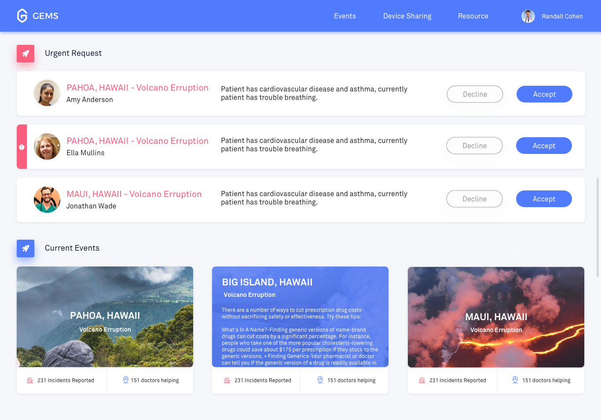

## GEMS 

This site is a group efforts of the five musketeers Diep, Ziwei, William, Gloria and Sarah. We made a web application to solve the issue of medical support in local, distant area or disaster zone. This application allow doctors across the world to do video call without little to none delay by integrating in agora.io. Doctors can share their instructions and knowledge to on-ground volunteer doctors who need assistance in helping patients disaster zone or in life-threatening conditions. This application also supports non-life-threatening cases. 

Technology used:
* Browserify, Run-all, Watchify, Live-server
* node.js
* HTML, CSS & JavaScript
* Boostrap
* agora.io 

Install this project:
* Fork & Clone this repository
* npm install
* npm run dev 

Note: This project is a product of Angel Hackathon in Seattle from July 21-22. 

